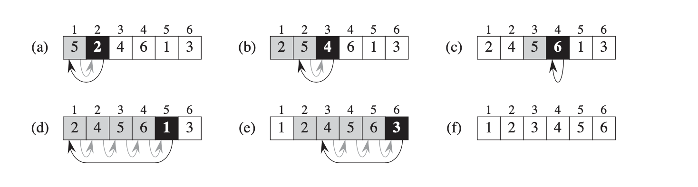
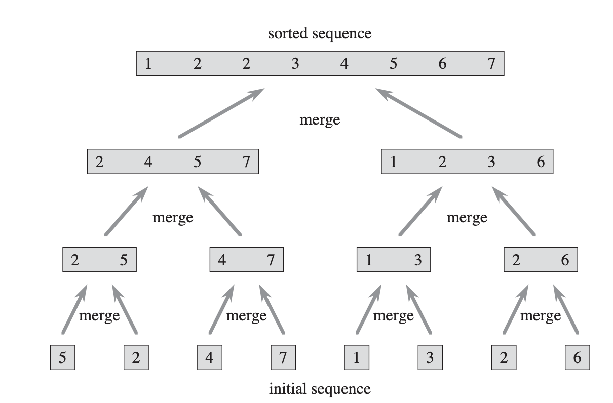

\thispagestyle{fancy}


[Book](https://runestone.academy/runestone/books/published/pythonds/index.html)

[Lecture Video for the Book](https://teklern.blogspot.com/p/blog-page.html)

# Recursion :

Recursion is the process of defining a problem (or the solution to a problem) in terms of (a simpler version) itself.

## Law of Recursive:

  - A recursive algorithm must  have a base case (when to stop)
  - A recursive algorithm must move toward the base case
  - A recursive algorithm must call itself recursively

## Code:

### Example 1:

```Python
def count_down(n):
  print(n,end='')
  if n>0:
    count_down(n-1)

```

### Example 2:

```Python
def sum_list(list):
  if len(list)==0:
    return 0
  return list[0]+sum_list(list[1:])

```

### Example 3:

Convert decimal to different base

```Python
def tostr(n,base):
  digits='0123456789ABCDEF'
  if n<base:
    return digits[n]
  return tostr(n // base,base) + digits[n % base]
```

### Example 4:

#### Check Palindrome
  * Recursive:

  ```Python
  def pallidnrome_recursive(num):
      s=str(num)
      if len(s) < 1:
          return True
      else:
          if s[0] == s[-1]:
              return pallidnrome_recursive(s[1:-1])
          else:
              return False
  ```
  * Second Way:

  ```Python
  def reverseDigits(num) :  

      rev_num = 0;  
      while (num > 0) :
          rev_num = rev_num * 10 + num % 10
          num = num // 10

      return rev_num  

  # Function to check if n is Palindrome
  def isPalindrome(n) :

      # get the reverse of n  
      rev_n = reverseDigits(n);  

      # Check if rev_n and n are same or not.  
      if (rev_n == n) :
          return 1
      else :
          return 0
```

### Example 5:

#### Fibonacci sequence:

  * Recursive:
```Python
def fib_recursive(num):
    if num <=1:
        return num
    return fib(num-1)+fib(num-2)
```
  * Loop:

```Python    
def fib_loop(num):
    n1,n2=0,1
    count=0
    if num==0:
        return 0
    elif num==1:
        return 1
    else:
        while count <num:
            nth=n1+n2
            n1=n2  # swap
            n2=nth # swap
            count +=1
        return n1

```
# Stack:

## Stack Array:

```Python
# Stack class implemented with array
class Stack:
    """Implements an efficient last-in first-out Abstract Data Type using a Python List"""

    # capacity is max number of Nodes, init_items is optional List parameter for initialization
    # if the length of the init_items List exceeds capacity, raise IndexError
    def __init__(self, capacity, init_items=None):
        """Creates an empty stack with a capacity"""
        self.capacity = capacity        # capacity of stack
        self.items = [None]*capacity    # array for stack
        self.num_items = 0              # number of items in stack
        if init_items is not None:      # if init_items is not None, initialize stack
            if len(init_items) > capacity:
                raise IndexError
            else:
                self.num_items = len(init_items)
                self.items[:self.num_items] = init_items

    def __eq__(self, other):
        return ((type(other) == Stack)
            and self.capacity == other.capacity
            and self.items[:self.num_items] == other.items[:other.num_items]
            )

    def __repr__(self):
        return ("Stack({!r}, {!r})".format(self.capacity, self.items[:self.num_items]))

    def is_empty(self):
        '''Returns True if the stack is empty, and False otherwise
           MUST have O(1) performance'''
        return self.num_items == 0


    def is_full(self):
        '''Returns True if the stack is full, and False otherwise
           MUST have O(1) performance'''
        return self.num_items==self.capacity


    def push(self, item):
        '''If stack is not full, pushes item on stack.
           If stack is full when push is attempted, raises IndexError
           MUST have O(1) performance'''
        if self.num_items==self.capacity:
            raise IndexError("The Stack is Full")
        self.items[self.num_items]=item
        self.num_items +=1
        # print(self.items.__repr__())
        # return self.items[self.num_items-1]


    def pop(self):
        '''If stack is not empty, pops item from stack and returns item.
           If stack is empty when pop is attempted, raises IndexError
           MUST have O(1) performance'''
        if self.num_items==0:
            raise IndexError("Index out of range")
        self.num_items -=1
        # print(self.items[self.num_items].__repr__())
        return self.items[self.num_items]


    def peek(self):
        '''If stack is not empty, returns next item to be popped (but does not remove the item)
           If stack is empty, raises IndexError
           MUST have O(1) performance'''
        if self.num_items==0:
            raise IndexError
        # print(self.items[self.num_items-1].__repr__())
        return self.items[self.num_items-1]


    def size(self):
        '''Returns the number of elements currently in the stack, not the capacity
           MUST have O(1) performance'''
        return self.num_items

```
## Stack Nodel List:

```Python
# NodeList is one of
# None or
# Node(value, rest), where rest is reference to the rest of the list
class Node:
    def __init__(self, value, rest):
        self.value = value      # object reference stored in Node
        self.rest = rest        # reference to NodeList
    def __eq__(self, other):
        return ((type(other) == Node)
          and self.value == other.value
          and self.rest == other.rest
        )
    def __repr__(self):
        return ("Node({!r}, {!r})".format(self.value, self.rest))

class Stack:
    """Implements an efficient last-in first-out Abstract Data Type using a node list"""

    # top is the top Node of stack
    def __init__(self, top=None):
        self.top = top              # top node of stack
        self.num_items = 0          # number of items in stack
        node = top                  # set number of items based on input
        while node is not None:
            self.num_items += 1
            node = node.rest

    def __eq__(self, other):
        return ((type(other) == Stack)
          and self.top == other.top
        )

    def __repr__(self):
        return ("Stack({!r})".format(self.top))

    def is_empty(self):
        '''Returns True if the stack is empty, and False otherwise
           MUST have O(1) performance '''
        return self.num_items==0

    def push(self, item):
        '''Pushes item on stack.
           MUST have O(1) performance'''
        new_stack=Node(item,self.top)
        self.rest=self.top
        self.top=new_stack
        self.num_items += 1

    def pop(self):
        '''If stack is not empty, pops item from stack and returns item.
           If stack is empty when pop is attempted, raises IndexError
           MUST have O(1) performance'''
        if self.top is None:
            raise IndexError
        self.num_items -=1
        temp=self.top.value
        self.top.value=None
        self.top=self.top.rest
        return temp

    def peek(self):
        '''If stack is not empty, returns next item to be popped (but does not remove the item)
           If stack is empty, raises IndexError
           MUST have O(1) performance'''
        if self.num_items==0:
            raise IndexError
        return self.top.value

    def size(self):
        '''Returns the number of elements currently in the stack, not the capacity
           MUST have O(1) performance'''
        return self.num_items

```
# Queue:

## Array:

```Python
# Queue ADT - circular array implementation

class Queue:
    """Implements an efficient first-in first-out Abstract Data Type using a Python List"""

    def __init__(self, capacity, init_items=None):
        """Creates a queue with a capacity and initializes with init_items"""
        self.capacity= capacity         # capacity of queue
        self.items = [None]*capacity    # array for queue
        self.num_items = 0              # number of items in queue
        self.front = 0                  # front index of queue (items removed from front)
        self.rear = 0                   # rear index of queue (items enter at rear)
        if init_items is not None:      # if init_items is not None, initialize queue
            if len(init_items) > capacity:
                raise IndexError
            else:
                self.num_items = len(init_items)
                self.items[:self.num_items] = init_items
                self.rear = self.num_items % self.capacity # % capacity addresses length=capacity

    def __eq__(self, other):
        return ((type(other) == Queue)
            and self.capacity == other.capacity
            and self.get_items() == other.get_items()
            )

    def __repr__(self):
        return ("Queue({!r}, {!r})".format(self.capacity, self.get_items()))

    # get_items returns array (Python list) of items in Queue
    # first item in the list will be front of queue, last item is rear of queue
    def get_items(self):
        if self.num_items == 0:
            return []
        if self.front < self.rear:
            return self.items[self.front:self.rear]
        else:
            return self.items[self.front:] + self.items[:self.rear]

    def is_empty(self):
        """Returns true if the queue is empty and false otherwise
        Must be O(1)"""
        return self.num_items==0

    def is_full(self):
        """Returns true if the queue is full and false otherwise
        Must be O(1)"""
        return self.num_items==self.capacity

    def enqueue(self, item):
        """enqueues item, raises IndexError if Queue is full
        Must be O(1)"""
        if self.is_full():
            raise IndexError
        self.items[self.rear]=item
        self.rear=(self.rear+1)%self.capacity # give the location which next time we need to be
        self.num_items += 1

    def dequeue(self):
        """dequeues and returns item, raises IndexError if Queue is empty
        Must be O(1)"""
        if self.is_empty():
            raise IndexError
        value=self.items[self.front]
        self.front=(self.front+1)%self.capacity
        self.num_items -=1
        return  value

    def size(self):
       """Returns the number of items in the queue
       Must be O(1)"""
       return self.num_items


```
## NodeList:

```Python
# NodeList version of ADT Queue

# Node class for use with Queue implemented with linked list
# NodeList is one of
# None or
# Node(value, rest), where rest is the rest of the list
class Node:
    def __init__(self, value, rest):
        self.value = value      # value
        self.rest = rest        # NodeList
    def __eq__(self, other):
        return ((type(other) == Node)
          and self.value == other.value
          and self.rest == other.rest
        )
    def __repr__(self):
        return ("Node({!r}, {!r})".format(self.value, self.rest))

class Queue:
    def __init__(self):
        self.rear = None    # rear NodeList
        self.front = None   # front NodeList
        self.num_items = 0  # number of items in Queue

    def __eq__(self, other):
        return ((type(other) == Queue)
            and self.get_items() == other.get_items()
        )

    def __repr__(self):
        return ("Queue({!r}, {!r})".format(self.rear, self.front))

    # get_items returns array (Python list) of items in Queue
    # first item in the list will be front of queue, last item is rear of queue
    def get_items(self):
        items = []
        front = self.front
        while front is not None:
            items.append(front.value)
            front = front.rest
        if self.rear is not None:
            rear_items = []
            rear = self.rear
            while rear is not None:
                rear_items.append(rear.value)
                rear = rear.rest
            rear_items.reverse()
            items.extend(rear_items)
        return items

    def is_empty(self):
        """Returns true if the queue is empty and false otherwise
        Must be O(1)"""
        return self.num_items==0

    def enqueue(self, item):
        """enqueues item, adding it to the rear NodeList
        Must be O(1)"""

        que=Node(item,self.rear)

        self.rear=que


        self.num_items+=1

    def dequeue(self):
        """dequeues item, removing first item from front NodeList
        If front NodeList is empty, remove items from rear NodeList
        and add to front NodeList until rear NodeList is empty
        If front NodeList and rear NodeList are both empty, raise IndexError
        Must be O(1) - general case"""
        if self.is_empty():
            raise IndexError
        self.num_items -= 1
        if self.front is not None:
            temp=self.front.value
            self.front=self.front.rest
            return temp
        if self.front is None:
            i=self.rear
            while i is not None:
                temp=i.value
                i=i.rest
                self.front=Node(temp,self.front)
                self.rear=self.rear.rest
            temp = self.front.value
            self.front = self.front.rest
            return temp

    def size(self):
        """Returns the number of items in the queue
        Must be O(1)"""
        return self.num_items


```

# Doubly Link List:

```Python
class Node:
    """Node for use with doubly-linked list"""
    def __init__(self, item, next=None, prev=None):
        self.item = item  # item held by Node
        self.next = next  # reference to next Node
        self.prev = prev  # reference to previous Node

class OrderedList:
    """A doubly-linked ordered list of integers,
    from lowest (head of list, sentinel.next) to highest (tail of list, sentinel.prev)"""
    def __init__(self, sentinel=None):
        """Use only a sentinel Node. No other instance variables"""
        self.sentinel = Node(None)
        self.sentinel.next = self.sentinel
        self.sentinel.prev = self.sentinel

    def is_empty(self):
        """Returns back True if OrderedList is empty"""
        return self.sentinel.next==self.sentinel


    def add(self, item):
        """Adds an item to OrderedList, in the proper location based on ordering of items
        from lowest (at head of list) to highest (at tail of list)
        If item is already in list, do not add again (no duplicate items)"""
        cur=self.sentinel.next
        while cur is not self.sentinel and item >cur.item:
            cur=cur.next
        if cur.item != item:
            temp=Node(item)
            temp.prev=cur.prev
            temp.next=cur
            cur.prev.next=temp
            cur.prev=temp


    def remove(self, item):
        """Removes an item from OrderedList. If item is removed (was in the list) returns True
        If item was not removed (was not in the list) returns False"""
        cur=self.sentinel
        if self.is_empty():
            return False
        else:
            while cur.next != self.sentinel:
                if cur.next.item == item:
                    cur.next=cur.next.next
                    cur.next.prev=cur
                    return True
                else:
                    cur=cur.next
            return False


    def index(self, item):
        """Returns index of an item in OrderedList (assuming head of list is index 0).
        If item is not in list, return None"""
        if self.is_empty():
            raise IndexError
        cur=self.sentinel.next
        num_item =0
        while cur.item != item:
            cur=cur.next
            num_item +=1
        return num_item


    def pop(self, index):
        """Removes and returns item at index (assuming head of list is index 0).
        If index is negative or >= size of list, raises IndexError"""
        cur = self.sentinel.next
        num_itemes = 0
        if self.is_empty():
            raise IndexError
        if index < 0:
            raise IndexError

        while cur != self.sentinel and num_itemes < index:
            cur = cur.next
            num_itemes += 1
        if cur == self.sentinel:
            raise IndexError
        else:
            ret_val = cur.item
            cur.next.prev = cur.prev
            cur.prev.next = cur.next
            return ret_val


    def search(self, item):
        """Searches OrderedList for item, returns True if item is in list, False otherwise  recursion"""
        def helper(cur,values):
            if cur == self.sentinel:
                return False
            if cur.item> values:
                return False
            elif cur.item == values:
                return True
            else:
                return helper(cur.next,values)
        cur=self.sentinel.next
        return helper(cur,item)

    def python_list(self):
        """Return a Python list representation of OrderedList, from head to tail
        For example, list with integers 1, 2, and 3 would return [1, 2, 3]"""
        list=[]
        cur=self.sentinel.next
        while  cur is not self.sentinel:
            list.append(cur.item)
            cur=cur.next
        return list

    def python_list_reversed(self):
        """Return a Python list representation of OrderedList, from tail to head, using recursion
        For example, list with integers 1, 2, and 3 would return [3, 2, 1] recursion"""
        def helper(cur):

            if cur.next ==self.sentinel:
                return [cur.item]
            else:
                return helper(cur.next)+[cur.item]
        cur=self.sentinel.next
        return helper(cur)


    def size(self):
        """Returns number of items in the OrderedList. O(n) is OK recursion"""
        def helper(cur):
            if cur == self.sentinel:
                return 0
            return helper(cur.next)+1
        cur=self.sentinel
        return helper(cur.next)

```
# Insertion Sort





## Code:

``` Python
def insertion_sort(A):
    for j in range(2,len(A)):
        key=A[j]
        i=j-1
        while i>0 and A[i]>key:
            A[i+1]=A[i]
            i=i-1
        A[i+1]=key
        return A
```

The $\theta(n)$ steps. Each steps have $\theta(n)$ swaps.

# Merge Sort:
{ width=40%}

## Code:

 ```Python
 def mergeSort(myList):
     if len(myList) > 1:
         mid = len(myList) // 2
         left = myList[:mid]
         right = myList[mid:]

         # Recursive call on each half
         mergeSort(left)
         mergeSort(right)

         # Two iterators for traversing the two halves
         i = 0
         j = 0

         # Iterator for the main list
         k = 0

         while i < len(left) and j < len(right):
             if left[i] < right[j]:
               # The value from the left half has been used
               myList[k] = left[i]
               # Move the iterator forward
               i += 1
             else:
                 myList[k] = right[j]
                 j += 1
             # Move to the next slot
             k += 1

         # For all the remaining values
         while i < len(left):
             myList[k] = left[i]
             i += 1
             k += 1

         while j < len(right):
             myList[k]=right[j]
             j += 1
             k += 1

myList = [54,26,93,17,77,31,44,55,20]
mergeSort(myList)
print(myList)
 ```


 The complexity $\theta(n)$.

 $T(n)=c_1+2T(\frac{n}{2})+c.n$

# Selection Sort:

## Code:

 ```Python
def selection_sort(A):
     # Traverse through all array elements
     for i in range(len(A)):

         # Find the minimum element in remaining  
         # unsorted array
         min_idx = i
         for j in range(i+1, len(A)):
             if A[min_idx] > A[j]:
                 min_idx = j

         # Swap the found minimum element with  
         # the first element         
         A[i], A[min_idx] = A[min_idx], A[i]
     return A

 ```
