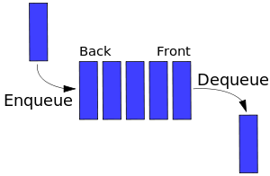

\thispagestyle{fancy}


[Book](https://runestone.academy/runestone/books/published/pythonds/index.html)

[Lecture Video for the Book](https://teklern.blogspot.com/p/blog-page.html)

[Good LectureTutorial(Java)](https://www.cs.cmu.edu/~adamchik/15-121/lectures/)

# The Steps for analyzing Algorithm:

  * time
  * space
  * network transformation
  * power consumption
  * cpu registers

{width=70%}
<!-- \cleardoublepage -->

# Recursion :

Recursion is the process of defining a problem (or the solution to a problem) in terms of (a simpler version) itself.

## Law of Recursive:

  - A recursive algorithm must  have a base case (when to stop)
  - A recursive algorithm must move toward the base case
  - A recursive algorithm must call itself recursively

## Code:

### Example 1:

```Python
def count_down(n):
  print(n,end='')
  if n>0:
    count_down(n-1)

```

### Example 2:

```Python
def sum_list(list):
  if len(list)==0:
    return 0
  return list[0]+sum_list(list[1:])

```

### Example 3:

Convert decimal to different base

```Python
def tostr(n,base):
  digits='0123456789ABCDEF'
  if n<base:
    return digits[n]
  return tostr(n // base,base) + digits[n % base]  
```

### Example 4:

#### Check Palindrome
  * Recursive:

  ```Python
  def pallidnrome_recursive(num):
      s=str(num)
      if len(s) < 1:
          return True
      else:
          if s[0] == s[-1]:
              return pallidnrome_recursive(s[1:-1])
          else:
              return False
  ```
  * Second Way:

  ```Python
  def reverseDigits(num) :  

      rev_num = 0;  
      while (num > 0) :
          rev_num = rev_num * 10 + num % 10
          num = num // 10

      return rev_num  

  # Function to check if n is Palindrome
  def isPalindrome(n) :

      # get the reverse of n  
      rev_n = reverseDigits(n);  

      # Check if rev_n and n are same or not.  
      if (rev_n == n) :
          return 1
      else :
          return 0
```

### Example 5:

#### Fibonacci sequence:

  * Recursive:
```Python
def fib_recursive(num):
    if num <=1:
        return num
    return fib(num-1)+fib(num-2)
```
  * Loop:

```Python    
def fib_loop(num):
    n1,n2=0,1
    count=0
    if num==0:
        return 0
    elif num==1:
        return 1
    else:
        while count <num:
            nth=n1+n2
            n1=n2  # swap
            n2=nth # swap
            count +=1
        return n1

```

### Example 6(Check if the item in the node list):

```Python
def search(item,node):
  if node.item==item:
    return True
  elif node==None:
    return False
  else:
     returnsearch(item,node.rest)
```

# Stack(LIFO):


## Stack Array:

```Python
# Stack class implemented with array
class Stack:
    """Implements an efficient last-in first-out Abstract Data Type using a Python List"""

    # capacity is max number of Nodes, init_items is optional List parameter for initialization
    # if the length of the init_items List exceeds capacity, raise IndexError
    def __init__(self, capacity, init_items=None):
        """Creates an empty stack with a capacity"""
        self.capacity = capacity        # capacity of stack
        self.items = [None]*capacity    # array for stack
        self.num_items = 0              # number of items in stack
        if init_items is not None:      # if init_items is not None, initialize stack
            if len(init_items) > capacity:
                raise IndexError
            else:
                self.num_items = len(init_items)
                self.items[:self.num_items] = init_items

    def __eq__(self, other):
        return ((type(other) == Stack)
            and self.capacity == other.capacity
            and self.items[:self.num_items] == other.items[:other.num_items]
            )

    def __repr__(self):
        return ("Stack({!r}, {!r})".format(self.capacity, self.items[:self.num_items]))

    def is_empty(self):
        '''Returns True if the stack is empty, and False otherwise
           MUST have O(1) performance'''
        return self.num_items == 0


    def is_full(self):
        '''Returns True if the stack is full, and False otherwise
           MUST have O(1) performance'''
        return self.num_items==self.capacity


    def push(self, item):
        '''If stack is not full, pushes item on stack.
           If stack is full when push is attempted, raises IndexError
           MUST have O(1) performance'''
        if self.num_items==self.capacity:
            raise IndexError("The Stack is Full")
        self.items[self.num_items]=item
        self.num_items +=1
        # print(self.items.__repr__())
        # return self.items[self.num_items-1]


    def pop(self):
        '''If stack is not empty, pops item from stack and returns item.
           If stack is empty when pop is attempted, raises IndexError
           MUST have O(1) performance'''
        if self.num_items==0:
            raise IndexError("Index out of range")
        self.num_items -=1
        # print(self.items[self.num_items].__repr__())
        return self.items[self.num_items]


    def peek(self):
        '''If stack is not empty, returns next item to be popped (but does not remove the item)
           If stack is empty, raises IndexError
           MUST have O(1) performance'''
        if self.num_items==0:
            raise IndexError
        # print(self.items[self.num_items-1].__repr__())
        return self.items[self.num_items-1]


    def size(self):
        '''Returns the number of elements currently in the stack, not the capacity
           MUST have O(1) performance'''
        return self.num_items

```
## Stack Nodel List:

```Python
# NodeList is one of
# None or
# Node(value, rest), where rest is reference to the rest of the list
class Node:
    def __init__(self, value, rest):
        self.value = value      # object reference stored in Node
        self.rest = rest        # reference to NodeList
    def __eq__(self, other):
        return ((type(other) == Node)
          and self.value == other.value
          and self.rest == other.rest
        )
    def __repr__(self):
        return ("Node({!r}, {!r})".format(self.value, self.rest))

class Stack:
    """Implements an efficient last-in first-out Abstract Data Type using a node list"""

    # top is the top Node of stack
    def __init__(self, top=None):
        self.top = top              # top node of stack
        self.num_items = 0          # number of items in stack
        node = top                  # set number of items based on input
        while node is not None:
            self.num_items += 1
            node = node.rest

    def __eq__(self, other):
        return ((type(other) == Stack)
          and self.top == other.top
        )

    def __repr__(self):
        return ("Stack({!r})".format(self.top))

    def is_empty(self):
        '''Returns True if the stack is empty, and False otherwise
           MUST have O(1) performance '''
        return self.num_items==0

    def push(self, item):
        '''Pushes item on stack.
           MUST have O(1) performance'''
        new_stack=Node(item,self.top)
        self.rest=self.top
        self.top=new_stack
        self.num_items += 1

    def pop(self):
        '''If stack is not empty, pops item from stack and returns item.
           If stack is empty when pop is attempted, raises IndexError
           MUST have O(1) performance'''
        if self.top is None:
            raise IndexError
        self.num_items -=1
        temp=self.top.value
        self.top.value=None
        self.top=self.top.rest
        return temp

    def peek(self):
        '''If stack is not empty, returns next item to be popped (but does not remove the item)
           If stack is empty, raises IndexError
           MUST have O(1) performance'''
        if self.num_items==0:
            raise IndexError
        return self.top.value

    def size(self):
        '''Returns the number of elements currently in the stack, not the capacity
           MUST have O(1) performance'''
        return self.num_items

```
\cleardoublepage
# Queue(FIFO):


{width=30%}


## Array:

```Python
# Queue ADT - circular array implementation

class Queue:
    """Implements an efficient first-in first-out Abstract Data Type using a Python List"""

    def __init__(self, capacity, init_items=None):
        """Creates a queue with a capacity and initializes with init_items"""
        self.capacity= capacity         # capacity of queue
        self.items = [None]*capacity    # array for queue
        self.num_items = 0              # number of items in queue
        self.front = 0                  # front index of queue (items removed from front)
        self.rear = 0                   # rear index of queue (items enter at rear)
        if init_items is not None:      # if init_items is not None, initialize queue
            if len(init_items) > capacity:
                raise IndexError
            else:
                self.num_items = len(init_items)
                self.items[:self.num_items] = init_items
                self.rear = self.num_items % self.capacity # % capacity addresses length=capacity

    def __eq__(self, other):
        return ((type(other) == Queue)
            and self.capacity == other.capacity
            and self.get_items() == other.get_items()
            )

    def __repr__(self):
        return ("Queue({!r}, {!r})".format(self.capacity, self.get_items()))

    # get_items returns array (Python list) of items in Queue
    # first item in the list will be front of queue, last item is rear of queue
    def get_items(self):
        if self.num_items == 0:
            return []
        if self.front < self.rear:
            return self.items[self.front:self.rear]
        else:
            return self.items[self.front:] + self.items[:self.rear]

    def is_empty(self):
        """Returns true if the queue is empty and false otherwise
        Must be O(1)"""
        return self.num_items==0

    def is_full(self):
        """Returns true if the queue is full and false otherwise
        Must be O(1)"""
        return self.num_items==self.capacity

    def enqueue(self, item):
        """enqueues item, raises IndexError if Queue is full
        Must be O(1)"""
        if self.is_full():
            raise IndexError
        self.items[self.rear]=item
        self.rear=(self.rear+1)%self.capacity # give the location which next time we need to be
        self.num_items += 1

    def dequeue(self):
        """dequeues and returns item, raises IndexError if Queue is empty
        Must be O(1)"""
        if self.is_empty():
            raise IndexError
        value=self.items[self.front]
        self.front=(self.front+1)%self.capacity
        self.num_items -=1
        return  value

    def size(self):
       """Returns the number of items in the queue
       Must be O(1)"""
       return self.num_items


```
## NodeList:

```Python
# NodeList version of ADT Queue

# Node class for use with Queue implemented with linked list
# NodeList is one of
# None or
# Node(value, rest), where rest is the rest of the list
class Node:
    def __init__(self, value, rest):
        self.value = value      # value
        self.rest = rest        # NodeList
    def __eq__(self, other):
        return ((type(other) == Node)
          and self.value == other.value
          and self.rest == other.rest
        )
    def __repr__(self):
        return ("Node({!r}, {!r})".format(self.value, self.rest))

class Queue:
    def __init__(self):
        self.rear = None    # rear NodeList
        self.front = None   # front NodeList
        self.num_items = 0  # number of items in Queue

    def __eq__(self, other):
        return ((type(other) == Queue)
            and self.get_items() == other.get_items()
        )

    def __repr__(self):
        return ("Queue({!r}, {!r})".format(self.rear, self.front))

    # get_items returns array (Python list) of items in Queue
    # first item in the list will be front of queue, last item is rear of queue
    def get_items(self):
        items = []
        front = self.front
        while front is not None:
            items.append(front.value)
            front = front.rest
        if self.rear is not None:
            rear_items = []
            rear = self.rear
            while rear is not None:
                rear_items.append(rear.value)
                rear = rear.rest
            rear_items.reverse()
            items.extend(rear_items)
        return items

    def is_empty(self):
        """Returns true if the queue is empty and false otherwise
        Must be O(1)"""
        return self.num_items==0

    def enqueue(self, item):
        """enqueues item, adding it to the rear NodeList
        Must be O(1)"""

        que=Node(item,self.rear)

        self.rear=que


        self.num_items+=1

    def dequeue(self):
        """dequeues item, removing first item from front NodeList
        If front NodeList is empty, remove items from rear NodeList
        and add to front NodeList until rear NodeList is empty
        If front NodeList and rear NodeList are both empty, raise IndexError
        Must be O(1) - general case"""
        if self.is_empty():
            raise IndexError
        self.num_items -= 1
        if self.front is not None:
            temp=self.front.value
            self.front=self.front.rest
            return temp
        if self.front is None:
            i=self.rear
            while i is not None:
                temp=i.value
                i=i.rest
                self.front=Node(temp,self.front)
                self.rear=self.rear.rest
            temp = self.front.value
            self.front = self.front.rest
            return temp

    def size(self):
        """Returns the number of items in the queue
        Must be O(1)"""
        return self.num_items


```

# Doubly Link List:

```Python
class Node:
    """Node for use with doubly-linked list"""
    def __init__(self, item, next=None, prev=None):
        self.item = item  # item held by Node
        self.next = next  # reference to next Node
        self.prev = prev  # reference to previous Node

class OrderedList:
    """A doubly-linked ordered list of integers,
    from lowest (head of list, sentinel.next) to highest (tail of list, sentinel.prev)"""
    def __init__(self, sentinel=None):
        """Use only a sentinel Node. No other instance variables"""
        self.sentinel = Node(None)
        self.sentinel.next = self.sentinel
        self.sentinel.prev = self.sentinel

    def is_empty(self):
        """Returns back True if OrderedList is empty"""
        return self.sentinel.next==self.sentinel


    def add(self, item):
        """Adds an item to OrderedList, in the proper location based on ordering of items
        from lowest (at head of list) to highest (at tail of list)
        If item is already in list, do not add again (no duplicate items)"""
        cur=self.sentinel.next
        while cur is not self.sentinel and item >cur.item:
            cur=cur.next
        if cur.item != item:
            temp=Node(item)
            temp.prev=cur.prev
            temp.next=cur
            cur.prev.next=temp
            cur.prev=temp


    def remove(self, item):
        """Removes an item from OrderedList. If item is removed (was in the list) returns True
        If item was not removed (was not in the list) returns False"""
        cur=self.sentinel
        if self.is_empty():
            return False
        else:
            while cur.next != self.sentinel:
                if cur.next.item == item:
                    cur.next=cur.next.next
                    cur.next.prev=cur
                    return True
                else:
                    cur=cur.next
            return False


    def index(self, item):
        """Returns index of an item in OrderedList (assuming head of list is index 0).
        If item is not in list, return None"""
        if self.is_empty():
            raise IndexError
        cur=self.sentinel.next
        num_item =0
        while cur.item != item:
            cur=cur.next
            num_item +=1
        return num_item


    def pop(self, index):
        """Removes and returns item at index (assuming head of list is index 0).
        If index is negative or >= size of list, raises IndexError"""
        cur = self.sentinel.next
        num_itemes = 0
        if self.is_empty():
            raise IndexError
        if index < 0:
            raise IndexError

        while cur != self.sentinel and num_itemes < index:
            cur = cur.next
            num_itemes += 1
        if cur == self.sentinel:
            raise IndexError
        else:
            ret_val = cur.item
            cur.next.prev = cur.prev
            cur.prev.next = cur.next
            return ret_val


    def search(self, item):
        """Searches OrderedList for item, returns True if item is in list, False otherwise  recursion"""
        def helper(cur,values):
            if cur == self.sentinel:
                return False
            if cur.item> values:
                return False
            elif cur.item == values:
                return True
            else:
                return helper(cur.next,values)
        cur=self.sentinel.next
        return helper(cur,item)

    def python_list(self):
        """Return a Python list representation of OrderedList, from head to tail
        For example, list with integers 1, 2, and 3 would return [1, 2, 3]"""
        list=[]
        cur=self.sentinel.next
        while  cur is not self.sentinel:
            list.append(cur.item)
            cur=cur.next
        return list

    def python_list_reversed(self):
        """Return a Python list representation of OrderedList, from tail to head, using recursion
        For example, list with integers 1, 2, and 3 would return [3, 2, 1] recursion"""
        def helper(cur):

            if cur.next ==self.sentinel:
                return [cur.item]
            else:
                return helper(cur.next)+[cur.item]
        cur=self.sentinel.next
        return helper(cur)


    def size(self):
        """Returns number of items in the OrderedList. O(n) is OK recursion"""
        def helper(cur):
            if cur == self.sentinel:
                return 0
            return helper(cur.next)+1
        cur=self.sentinel
        return helper(cur.next)

```
\cleardoublepage

# Binary Tree:

<!-- The hight of binary tree is $log(n)$ -->

<!-- {width=60%} -->

|       | Insert | search  |   min  |   max  | Transversals  | height |
|:-----:|:------:|:-------:|:------:|:------:|:-------------:|:------:|
| Big O | log(n) |  log(n) | log(n) | log(n) |      O(n)     |  O(n)  |

## Three type of trees:

* Full: leaf with no children or with to leaves
* Complete: fill up top to bottom and left to right
* Perfect: all leaves and nodes are at the same level

{width=80%}

## Traversal:

* **Pre Order** : n l r
* **In Order** :  l n r
* **Post Order**: l r n

### In OrderedList:

```Python
def inorder_list(self):
# return Python list of BST keys representing in-order traversal of BST (LVR--->left visit right)
    def _inorder(current,list):
        if current != None:
            _inorder(current.left,list)
            list.append(current.key)
            _inorder(current.right,list)

        return list

    return _inorder(self.root,[])
```
### PreOreder:

```Python
def preorder_list(self):  
# return Python list of BST keys representing pre-order traversal of BST (VLR-> Visit Left Right)
      def _preorder(current,list):
          if current !=None:
              list.append(current.key)
              _preorder(current.left,list)
              _preorder(current.right,list)
          return list

      return _preorder(self.root,[])
```
### Level order list:

```Python

def level_order_list(self):  
  # return Python list of BST keys representing level-order traversal of BST
  # You MUST use your queue_array data structure from lab 3 to implement this method
    q = Queue(25000) # Don't change this!
    list1 = []
    if self.root == None:
        return None

    q.enqueue(self.root) # adding whole root q Stack

    while  q.is_empty()==False:
        root=q.dequeue()
        list1.append(root.key)
        if root.left != None:
            q.enqueue(root.left)
        if root.right != None:
            q.enqueue(root.right)

    return list1
```
<!--  -->
## Calculate the Hight:

```Python
def height(self,node):
  if node==None:
    return 0
  left=self.height(node.left)
  right=self.height(node.right)
  return 1 + max(left,right)
```

## Insertion:

```Python
def insert(self, key, data=None): # inserts new node w/ key and data
        # If an item with the given key is already in the BST,
        # the data in the tree will be replaced with the new data
        # Example creation of node: temp = TreeNode(key, data)
        def _insert(key,cur_node,data):
            if key <cur_node.key:
                if cur_node.left == None:
                    cur_node.left=TreeNode(key,data)
                else:
                    _insert(key,cur_node.left,data)
            elif key> cur_node.key:
                if cur_node.right==None:
                    cur_node.right=TreeNode(key,data)
                else:
                    _insert(key,cur_node.right,data)
            else:
                cur_node.data=data # update the data
            return cur_node


        if self.root==None:
            self.root=TreeNode(key,data)
        else:
            self.root=_insert(key,self.root,data)

```

## Search:

```Python
def search(self, key):
# returns True if key is in a node of the tree, else False
      def _search(key,current_node):
          if key==current_node.key:
              return True
          elif key < current_node.key and current_node.left !=None:
              return _search(key, current_node.left)
          elif key>current_node.key and current_node.right !=None:
              return _search(key, current_node.right)
          return False
      if self.root != None:
          return _search(key,self.root)
      else:
          return False
```

## Min:

```Python
def find_min(self):
  # returns a tuple with min key and data in the BST
  # returns None if the tree is empty
      if self.is_empty():
          return None
      def _min(current):
          if current is None:
              return None
          if current.left is None:
              return current.key, current.data
          return _min(current.left)

      return _min(self.root)
```

## Max:

```Python
def find_max(self): # returns a tuple with max key and data in the BST
      # returns None if the tree is empty
      if self.is_empty():
          return None
      def _max(current):
          if current is None:
              return None
          if current.right is None:
              return current.key, current.data
          return _max(current.right)

      return _max(self.root)
  ```


\cleardoublepage

<!-- ## Insertion: -->

# Sorting:
{width=60%}

[Summery with animation](https://medium.com/@bill.shantang/8-classical-sorting-algorithms-d048eec3fdab)

## Bubble Sort:
{width=40%}

```Python
def bubble_sort(A):
    for k in range(len(A)):
        flag=0 # check if one time run but we did not swap anything for code efficiency
        for i in range(len(A)-k-1):
            if A[i]>A[i+1]:
                A[i],A[i+1]=A[i+1],A[i]
                flag=1
        if flag==0:
            break
```

\cleardoublepage

## Insertion Sort:


### Code:

``` Python
def insertion_sort(alist):
    com = 0 # How many comparison the code do
    for i in range (1, len (alist)):
        value = alist[i]
        j = i - 1
        while j >= 0:
            com += 1
            if value<alist[j]:
                alist[j + 1] = alist[j]
                alist[j] = value
                j = j - 1
            else:
                break
    return com
```

The $\theta(n)$ steps. Each steps have $\theta(n)$ swaps.

\cleardoublepage

## Selection Sort:

{width=50%}

* Find the minimum value in the list
* Swap it with the value in the first position
* Repeat the steps above for the remainder of the list (starting at the second position and advancing each time)

### Code:

 ```Python
def selection_sort(A):
     # Traverse through all array elements
     for i in range(len(A)):

         # Find the minimum element in remaining  
         # unsorted array
         min_idx = i
         for j in range(i+1, len(A)):
             if A[min_idx] > A[j]:
                 min_idx = j

         # Swap the found minimum element with  
         # the first element         
         A[i], A[min_idx] = A[min_idx], A[i]
     return A

 ```

## Merge Sort:

{ width=60%}

### Code:

 ```Python
 def mergeSort(myList):
     if len(myList) > 1:
         mid = len(myList) // 2
         left = myList[:mid]
         right = myList[mid:]

         # Recursive call on each half
         mergeSort(left)
         mergeSort(right)

         # Two iterators for traversing the two halves
         i = 0
         j = 0

         # Iterator for the main list
         k = 0

         while i < len(left) and j < len(right):
             if left[i] < right[j]:
               # The value from the left half has been used
               myList[k] = left[i]
               # Move the iterator forward
               i += 1
             else:
                 myList[k] = right[j]
                 j += 1
             # Move to the next slot
             k += 1

         # For all the remaining values
         while i < len(left):
             myList[k] = left[i]
             i += 1
             k += 1

         while j < len(right):
             myList[k]=right[j]
             j += 1
             k += 1

myList = [54,26,93,17,77,31,44,55,20]
mergeSort(myList)
print(myList)
 ```


 The complexity $\theta(n)$.

 $T(n)=c_1+2T(\frac{n}{2})+c.n$

## Quick Sort:

The time complexity in best way is **$O(nlog(n))$** and the worst case scenario is when is whole list already sorted so the time complexity is **$O(n^2)$**.


### Code:

```Python
def partition(arr,low,high):
    i = ( low-1 )         # index of smaller element
    pivot = arr[high]     # pivot

    for j in range(low , high):

        # If current element is smaller than or
        # equal to pivot
        if   arr[j] <= pivot:

            # increment index of smaller element
            i = i+1
            arr[i],arr[j] = arr[j],arr[i]

    arr[i+1],arr[high] = arr[high],arr[i+1]
    return ( i+1 )

# The main function that implements QuickSort
# arr[] --> Array to be sorted,
# low  --> Starting index,
# high  --> Ending index

# Function to do Quick sort
def quickSort(arr,low,high):
    if low < high:

        # pi is partitioning index, arr[p] is now
        # at right place
        pi = partition(arr,low,high)

        # Separately sort elements before
        # partition and after partition
        quickSort(arr, low, pi-1)
        quickSort(arr, pi+1, high)
```
\cleardoublepage
## Heap Sort:

[Reference Book](https://runestone.academy/runestone/books/published/pythonds/Trees/BinaryHeapImplementation.html)

{width=60%}

***BigO***: Heap enqueue, dequeue, perc_up, perc_down are O(log(n)), build heap is O(n).

  * its left child is at **2*i**.
  * its right child is at **2*i+1**.
  * its parent is at **$[\frac{i}{2}]$**.

**Max Heap:** it is a complete binary and all node have greater than descending.

**Min Heap:** it is a complete binary and all node have less than descending.

<!-- ### Insertion:

The time of insertion is **O(1) to O(log(n))**.

### Deletion:

 The time of deletion is **O(log(n))**.

 By deletion and saving the element we will get sorted list. -->

### Code:

 ```Python

 class MaxHeap:

     def __init__(self, capacity=50):
"""Constructor creating an empty heap with default capacity = 50 but allows heaps
 of other capacities to be created."""
         self.heap = [None]*(capacity+1)     # index 0 not used for heap
         self.size = 0                       # empty heap


     def enqueue(self, item): # nlog(n)
         """inserts "item" into the heap
         Raises IndexError if there is no room in the heap"""
         if self.is_full():
             raise IndexError
         self.size +=1
         self.heap[self.size]=item # Insert to the last element in the list
         self.perc_up(self.size)


     def peek(self):
         """returns max without changing the heap
         Raises IndexError if the heap is empty"""
         if self.is_empty():
             raise IndexError
         return self.heap[1] # index one becuase we start from one not from index zero


     def dequeue(self): # nlog(n)
         """returns max and removes it from the heap and restores the heap property
            Raises IndexError if the heap is empty"""
         if self.is_empty():
             raise IndexError
         max=self.heap[1] # save the top element as the max
         self.heap[1]=self.heap[self.size] # Replace the last element with the root
         self.heap[self.size]=max  # Bring the max to the end of array
         self.size -= 1
         self.heap.pop()
         self.perc_down(1) # perc down the root element(max) down
         return max


     def contents(self):
         """returns a list of contents of the heap in the order it is stored internal to the heap.
         (This may be useful for in testing your implementation.)
         If heap is empty, returns empty list []"""
         if self.is_empty():
             return []

         return self.heap[1:self.size+1]


     def build_heap(self, alist):
         """Discards the items in the current heap and builds a heap from
         the items in alist using the bottom up method.  
         If the capacity of the current heap is less than the number of
         items in alist, the capacity of the heap will be increased to accommodate the items in alist"""


         i = 0
         self.size = len(alist)
         while i < len(alist):
             if i > self.get_capacity() - 1:
                 self.heap.append(alist[i]) # We need to append becuase the capacity of list finish
             else:
                 self.heap[i + 1] = alist[i] # i+1 becuase we start at index 1 and index 0 is zero
             i += 1
         i = self.size
         while i > 0:
             self.perc_down(i)
             i -= 1


         # ----------------- Second Way ---------------------------#
         # self.size = 0
         # for i in range(len(alist)):
         #     if i < len(self.heap) - 1:
         #         self.heap[i + 1] = alist[i]  # taking values from alist and assigning them into the heap
         #         self.size += 1  # counting size again
         #     else:
         #         self.heap.append(alist[i])  # if we've passed capacity, it's okay we'll just keep adding
         #         self.size += 1
         # for i in range(self.size, 0, -1):  # starting from the bottom, we want to perc everything down
         #     self.perc_down(i)

     def is_empty(self):
         """returns True if the heap is empty, False otherwise"""
         return self.size == 0


     def is_full(self):
         """returns True if the heap is full, False otherwise"""
         return self.size == self.get_capacity()


     def get_capacity(self):
         """This is the maximum number of a entries the heap can hold, which is
         1 less than the number of entries that the array allocated to hold the heap can hold"""
         return len(self.heap)-1


     def get_size(self):
         """the actual number of elements in the heap, not the capacity"""
         return self.size


     def perc_down(self, i): #log(n)
         """where the parameter i is an index in the heap and perc_down moves the element stored
         at that location to its proper place in the heap rearranging elements as it goes."""


         done = False
         while not done and 2 * i <= self.size:  # at least one child
             child1 = 2 * i
             child2 = child1 + 1
             if child2 <= self.size and self.heap[child1] < self.heap[child2]: # child2 > child1
                 if self.heap[i] < self.heap[child2]: # child2 > parent
                     self.heap[i], self.heap[child2] = self.heap[child2], self.heap[i]# swap the element
                     i = child2 #change index to child 2
                 else:
                     done = True
             else:  # one child or child1 is smaller
                 if self.heap[i] < self.heap[child1]: # child 1 is greater
                     self.heap[i], self.heap[child1] = self.heap[child1], self.heap[i]
                     i = child1
                 else:
                     done = True


     def perc_up(self, i):
         """where the parameter i is an index in the heap and perc_up moves the element stored
         at that location to its proper place in the heap rearranging elements as it goes."""

         while (i) // 2 >= 1:
             if self.heap[i] > self.heap[i // 2]: # Check the current element with parent
                 self.heap[i],self.heap[i//2]=self.heap[i//2],self.heap[i] # Swap the elements
             i =i// 2


     def heap_sort_ascending(self, alist):
         """perform heap sort on input alist in ascending order
         This method will discard the current contents of the heap, build a new heap using
         the items in alist, and mutate alist to put the items in ascending order"""
         self.build_heap (alist)
         while self.size > 0:
             maxValue = self.dequeue ()   # Pop the root elements
             alist[self.size] = maxValue  # add to end of the least becuase of maximum at root

```


## Hash Map:

Everything time complexity is O(1)

```Python
class MyHashTable:

    def __init__(self, table_size=11):
        self.table_size = table_size
        self.hash_table = [[] for _ in range(table_size)] # List of lists implementation
        self.num_items = 0
        self.num_collisions = 0
    def __repr__(self):
        return "{}".format(self.hash_table)

    def insert(self, key, value):
        """Takes a key, and an item.  Keys are valid Python non-negative integers.
        If key is negative, raise ValueError exception
        The function will insert the key-item pair into the hash table based on the
        hash value of the key mod the table size (hash_value = key % table_size)"""
        if key < 0:
            raise ValueError
        hash_value = key % self.table_size
        flag = True
        i = 0
        if self.hash_table[hash_value] == []:  # Check if the place I want to add is empty or not
            self.hash_table[hash_value].append ((key, value))
            self.num_items += 1
        else:
            while i < len (self.hash_table[hash_value]):
                if self.hash_table[hash_value][i][0] == key:  # We already have this key
                    self.hash_table[hash_value][i] = (key, value)
                    flag = False
                    break

                i += 1
            if flag:  # We don't have the key
                self.hash_table[hash_value].append ((key, value))
                self.num_collisions += 1


                self.num_items += 1


        if self.load_factor () > 1.5:

            old_hash = self.hash_table
            new_value = 2 * self.table_size + 1
            self.hash_table = [[] for _ in range (new_value)]
            self.table_size = 2 * self.table_size + 1


            for i in range (len (old_hash)):
                for j in old_hash[i]:
                    new_hash = j[0] % new_value
                    self.hash_table[new_hash] = j
                    self.num_collisions -= 1


    def get_item(self, key):
        """Takes a key and returns the item from the hash table associated with the key.
        If no key-item pair is associated with the key, the function raises a LookupError exception."""

        hash_value = key % self.table_size
        for i in range (len (self.hash_table[hash_value])):
            if self.hash_table[hash_value][i][0] == key:
                return self.hash_table[hash_value][i][1]
        raise LookupError


    def remove(self, key):
        """Takes a key, removes the key-item pair from the hash table and returns the key-item pair.
        If no key-item pair is associated with the key, the function raises a LookupError exception.
        (The key-item pair should be returned as a tuple)"""
        hash_value = key % self.table_size

        for i in range(len(self.hash_table[hash_value])):
            if self.hash_table[hash_value][i][0] == key:

                self.num_items -=1
                return self.hash_table[hash_value].pop(i)

        raise LookupError


    def load_factor(self):
        """Returns the current load factor of the hash table"""
        return self.num_items/self.table_size

    def size(self):
        """Returns the number of key-item pairs currently stored in the hash table"""
        return self.num_items

    def collisions(self):
        """Returns the number of collisions that have occurred during insertions into the hash table"""
        return self.num_collisions

  ```

# Graph:

{width=60%}

## Breath First Search:

**Sudo Code:**

 * While Q in not empty:
 * dequeue the vertex, add to output
 * queue adjacent vertices that have not been visited


## Depth First search:

**Sudo Code:**

  * While stack not empty:
  * pop the vertex
  * if not visited
      * Mark as visted
      * add to the output
  * push the adjacent

## Top Logical Sorting:

* while stack not empty:
* pop the output of vertex
* reduce the indegree of all adjacent vertex
* push all new vertex with indegree of zero


```Python

from sys import argv
from stack_array import *

def tsort(vertices):
    '''
    * Performs a topological sort of the specified directed acyclic graph.  The
    * graph is given as a list of vertices where each pair of vertices represents
    * an edge in the graph.  The resulting string return value will be formatted
    * identically to the Unix utility {@code tsort}.  That is, one vertex per
    * line in topologically sorted order.
    *
    * Raises a ValueError if:
    *   - vertices is emtpy with the message "input contains no edges"         Done
    *   - vertices has an odd number of vertices (incomplete pair) with the   Done
    *     message "input contains an odd number of tokens"
    *   - the graph contains a cycle (isn't acyclic) with the message
    *     "input contains a cycle"'''
#---------------------------error checking---------------------------------------#
    if vertices==[]:
        raise ValueError("input contains no edges")
    elif len(vertices)%2==1:
        raise ValueError("input contains an odd number of tokens")


    stack=Stack(len(vertices))

    data={}
    # ---------------------Build the dictionery of vertex---------------------------#

    for i in range(0, len(vertices), 2):
        if vertices[i] not in data.keys():  # Build new Keys
            data[vertices[i]] = [vertices[i], [], 0]
        if vertices[i + 1] not in data.keys():  # Build new keys for second element
            data[vertices[i + 1]] = [vertices[i + 1], [], 0]
        data[vertices[i]][1].append(vertices[i + 1])  # appending second element to first vertices
        data[vertices[i + 1]][2] += 1  # incerease the indegree

    list2 = ''
    count = 0  # count the number of element in the list
    # ---------------------------Top logical sorting----------------------------------#

    find_zero(data, stack, list2)
    while not stack.is_empty():
        value = stack.peek()
        list2 += stack.pop() + "\n"
        count += 1

        for vertc in data[value][1]:  # Go to the peek in stak and get the value vertices and decrease one
            data[vertc][2] -= 1  # decrease indegree

        find_zero(data, stack, list2)

    if count != len(data):  # Graph contain cycle
        raise ValueError("input contains a cycle")

    return list2.strip()


def find_zero(data, stack, list2):  # helper function for finding the elements that indegree is zero
    for item in data.items():
        if item[1][2] == 0:  # check and push the elemnt which indegree is zero
            stack.push(item[0])
            item[1][2] = -1  # already take out the element to the stach
    return stack


def main():
    '''Entry point for the tsort utility allowing the user to specify
       a file containing the edge of the DAG'''
    if len(argv) != 2:
        print("Usage: python3 tsort.py <filename>")
        exit()
    try:
        f = open(argv[1], 'r')
    except FileNotFoundError as e:
        print(argv[1], 'could not be found or opened')
        exit()

    vertices = []
    for line in f:
        vertices += line.split()

    try:
        result = tsort(vertices)
        print(result)
    except Exception as e:
        print(e)

if __name__ == '__main__':
    main()
```

## Red Black Tree:

### Time complexity:
height: O(log(n))
{width=50%}

## Recognizing:
* **Root Property**: The root is Black
* **External Property:** Every external node is Black
* **Red property:** The children of a red node are Black
* **Depth property:** All external nodes have the same black Depth.

## Insertion:
**Case1:**

* Relabel the nodes to a, b and c from left to right.

* Replace the original z with b. Make a and c its children. Keep inorder relationships unchanged.

{width=60%}

**Case2:**

* Color y and s to black and z to red

* If z is the root or the parent of z is red, repeat recoloring for z.

{width=60%}
