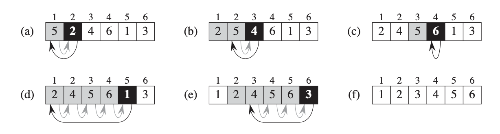
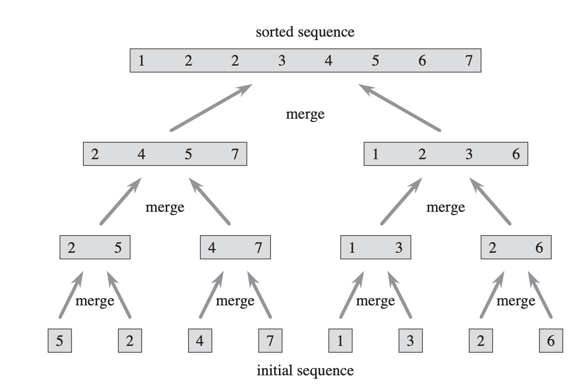

\thispagestyle{fancy}

[Book](https://runestone.academy/runestone/books/published/pythonds/index.html)

[Lecture Video for the Book](https://teklern.blogspot.com/p/blog-page.html)

# Recursion :

Recursion is the process of defining a problem (or the solution to a problem) in terms of (a simpler version) itself.

## Law of Recursive:

  - A recursive algorithm must  have a base case (when to stop)
  - A recursive algorithm must move toward the base case
  - A recursive algorithm must call itself recursively

## Code:

### Example 1:

```Python
def count_down(n):
  print(n,end='')
  if n>0:
    count_down(n-1)

```

### Example 2:

```Python
def sum_list(list):
  if len(list)==0:
    return 0
  return list[0]+sum_list(list[1:])

```

### Example 3:

```Python
def tostr(n,base):
  digit='0123456789ABCDEF'
  if n<base:
    return digits[n]
  return tostr(n // base,base) + digits[n % base]
```

# Insertion Sort




## Code:

``` Python
def insertion_sort(A):
    for j in range(2,len(A)):
        key=A[j]
        i=j-1
        while i>0 and A[i]>key:
            A[i+1]=A[i]
            i=i-1
        A[i+1]=key
        return A
```

The $\theta(n)$ steps. Each steps have $\theta(n)$ swaps.

# Merge Sort:
{ width=40%}

## Code:

 ```Python
 def mergeSort(myList):
     if len(myList) > 1:
         mid = len(myList) // 2
         left = myList[:mid]
         right = myList[mid:]

         # Recursive call on each half
         mergeSort(left)
         mergeSort(right)

         # Two iterators for traversing the two halves
         i = 0
         j = 0

         # Iterator for the main list
         k = 0

         while i < len(left) and j < len(right):
             if left[i] < right[j]:
               # The value from the left half has been used
               myList[k] = left[i]
               # Move the iterator forward
               i += 1
             else:
                 myList[k] = right[j]
                 j += 1
             # Move to the next slot
             k += 1

         # For all the remaining values
         while i < len(left):
             myList[k] = left[i]
             i += 1
             k += 1

         while j < len(right):
             myList[k]=right[j]
             j += 1
             k += 1

myList = [54,26,93,17,77,31,44,55,20]
mergeSort(myList)
print(myList)
 ```


 The complexity $\theta(n)$.

 $T(n)=c_1+2T(\frac{n}{2})+c.n$

# Selection Sort:

## Code:

 ```Python
 def selection_sort(A):
     # Traverse through all array elements
     for i in range(len(A)):

         # Find the minimum element in remaining  
         # unsorted array
         min_idx = i
         for j in range(i+1, len(A)):
             if A[min_idx] > A[j]:
                 min_idx = j

         # Swap the found minimum element with  
         # the first element         
         A[i], A[min_idx] = A[min_idx], A[i]
     return A

 ```
